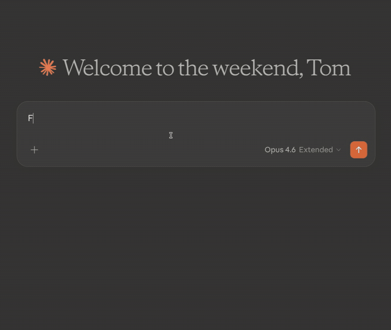

# Thunderbird Agent

[](#what-you-can-do)
[](#security)
[](https://www.thunderbird.net/)
[](LICENSE)

Give AI agents safe, scriptable access to Thunderbird — search mail, compose drafts, manage filters, and organize inboxes — without depending on MCP.

This repo now ships in three layers:

- **Thunderbird extension** — the real execution engine and permission boundary
- **local CLI** — the primary integration surface for agents, scripts, and debugging
- **vendor-neutral skill + instruction pack** — reusable guidance for Claude Code, Codex, OpenClaw, Hermes, and other terminal-capable agents

All three layers talk to the same localhost-only Thunderbird extension.

<p align="center">
  
</p>

> Inspired by [bb1/thunderbird-mcp](https://github.com/bb1/thunderbird-mcp). The current upstream repo URL may still carry the legacy `thunderbird-mcp` path until the repository itself is renamed.

---

## Why?

Thunderbird still has no official AI-first automation surface. This project fills that gap with a local, review-friendly tool layer so AI agents can help with real mailbox work: reading, drafting, sorting, filtering, contacts, and calendar actions.

Compose tools open a review window before sending by default. Set `skipReview` only when the user has already approved direct sending. **Nothing has to leave the outbox silently.**

---

## How it works

```
                              HTTP (localhost:8765-8774)
  AGENTS.md / CLAUDE.md / skill  ────────────────────────┐
  thunderbird-agent CLI          ────────────────────────┴──> Thunderbird extension + HTTP server
```

Internally, the repo is split into:

- `packages/core/` — connection discovery, auth, retry, and HTTP transport
- `packages/cli/` — reusable `thunderbird-agent` command-line interface
- `skills/` + repo instruction files — vendor-neutral reusable guidance for different AI agents
- `extension/` — Thunderbird-side execution engine and access control

The extension writes a session-scoped connection file containing the live port and auth token. The shared transport discovers that file automatically, then the CLI and repo instruction surfaces reuse the same transport layer.

---

## What you can do

### Mail

| Tool | Description |
|------|-------------|
| `listAccounts` | List all email accounts and their identities |
| `listFolders` | Browse folder trees with message counts |
| `searchMessages` | Search by sender, subject, recipients, tags, date range, or full-text body |
| `getMessage` | Read full message content, including raw source or saved attachments |
| `getRecentMessages` | Get recent mail with date/unread/tag filtering |
| `displayMessage` | Open a message in Thunderbird |
| `updateMessage` | Mark read, flag, tag, move, or trash messages |
| `deleteMessages` | Delete messages safely |
| `createFolder` / `renameFolder` / `moveFolder` / `deleteFolder` | Manage folders |
| `emptyTrash` / `emptyJunk` | Permanently clean Trash or Junk |

### Compose

| Tool | Description |
|------|-------------|
| `sendMail` | Draft or send a new email |
| `replyToMessage` | Reply with correct threading |
| `forwardMessage` | Forward while preserving attachments |

### Filters

| Tool | Description |
|------|-------------|
| `listFilters` | Inspect filter rules |
| `createFilter` | Create sorting rules |
| `updateFilter` | Modify existing rules |
| `deleteFilter` | Remove rules |
| `reorderFilters` | Change priority |
| `applyFilters` | Run filters on demand |

### Contacts

| Tool | Description |
|------|-------------|
| `searchContacts` | Search address books |
| `createContact` | Add contacts |
| `updateContact` | Edit contacts |
| `deleteContact` | Remove contacts |

### Calendar

| Tool | Description |
|------|-------------|
| `listCalendars` | List calendars |
| `createEvent` / `updateEvent` / `deleteEvent` | Manage calendar events |
| `listEvents` | Query events across date ranges |
| `createTask` / `listTasks` / `updateTask` | Manage Thunderbird tasks |

### Access Control

| Tool | Description |
|------|-------------|
| `getAccountAccess` | View which accounts external agent calls can access |

Access control is configured by the user in the extension settings page. Agents can read it but not widen it.

---

## Setup

### 1. Clone the repo

```bash
git clone https://github.com/buddhism5080/thunderbird-agent.git
cd thunderbird-agent
```

### 2. Install the extension

Install `dist/thunderbird-agent.xpi` in Thunderbird (Tools > Add-ons > Install from File), then restart Thunderbird.

### 3. Use the CLI

```bash
# Health / discovery check
node packages/cli/thunderbird-agent.cjs doctor

# List live tools from a running Thunderbird session
node packages/cli/thunderbird-agent.cjs tools list

# Inspect the offline catalog without Thunderbird running
node packages/cli/thunderbird-agent.cjs tools list --catalog

# Call one tool directly
node packages/cli/thunderbird-agent.cjs tools call searchMessages --args '{"query":"invoice","maxResults":10}'
```

After `npm install -g` or `npm link`, the same commands work as:

```bash
thunderbird-agent doctor
thunderbird-agent tools list
```

### 4. Give agents repo-local instructions

This repo intentionally uses **CLI + instruction files + skill** instead of a vendor-specific agent protocol layer.

Use these surfaces:

- `AGENTS.md` — broad project instructions for agent runtimes that honor AGENTS-style files
- `CLAUDE.md` — Claude Code specific companion instructions
- `skills/thunderbird-agent/SKILL.md` — vendor-neutral reusable Thunderbird workflow skill
- `docs/agents/` — short CLI-first notes for Claude Code, Codex, and OpenClaw

Recommended usage:

1. give the agent this repo as working context so it can read `AGENTS.md` / `CLAUDE.md`
2. let the agent call the local CLI directly
3. load or reference `skills/thunderbird-agent/SKILL.md` for repeatable workflows

### Sandbox-aware connection discovery

The shared transport re-discovers `connection.json` on every cache miss. It tries these locations in order:

1. `THUNDERBIRD_AGENT_CONNECTION_FILE`, if set
2. Native temp dir: `<os.tmpdir()>/thunderbird-agent/connection.json`
3. macOS fallback: `/var/folders/*/*/T/thunderbird-agent/connection.json` owned by the current user
4. Linux Snap: Thunderbird's live `TMPDIR` from `/proc/<pid>/environ`, plus the official snap fallback under `~/Downloads/thunderbird.tmp`
5. Linux Flatpak / Betterbird Flatpak: `$XDG_RUNTIME_DIR/app/*/thunderbird-agent/connection.json`

Example override:

```bash
export THUNDERBIRD_AGENT_CONNECTION_FILE=/absolute/path/to/connection.json
export THUNDERBIRD_AGENT_CLI=/absolute/path/to/thunderbird-agent/packages/cli/thunderbird-agent.cjs
```

---

## Security

- **Auth tokens**: The HTTP server requires a session-scoped bearer token and writes it to a local connection file with 0600 permissions.
- **Dynamic port**: The extension chooses an available localhost port in the configured range and records it in the connection file.
- **Account access control**: Restrict which Thunderbird accounts external agent calls can see.
- **Tool access control**: Disable risky or unwanted tools from the options page.
- **Localhost only**: No remote access.

---

## Troubleshooting

| Problem | Fix |
|---------|-----|
| Extension not loading | Check Tools > Add-ons and Themes; inspect the Thunderbird Error Console |
| Connection refused | Make sure Thunderbird is running and the extension is enabled |
| CLI can't find `connection.json` | Set `THUNDERBIRD_AGENT_CONNECTION_FILE` explicitly |
| Missing recent emails | IMAP folders may be stale; click the folder in Thunderbird or repair it |

---

## Development

```bash
npm test
node packages/cli/thunderbird-agent.cjs doctor
node packages/cli/thunderbird-agent.cjs tools list --catalog
```

For raw debugging, you can also send a JSON-RPC payload through the CLI transport:

```bash
echo '{"jsonrpc":"2.0","id":1,"method":"tools/list"}' | node packages/cli/thunderbird-agent.cjs rpc
```

---

## Repo layout

```text
thunderbird-agent/
├── AGENTS.md
├── CLAUDE.md
├── README.md
├── docs/
│   └── agents/
├── extension/
│   └── agent_server/
├── packages/
│   ├── core/
│   └── cli/
│       └── thunderbird-agent.cjs
├── scripts/
├── shared/
├── skills/
│   └── thunderbird-agent/
└── test/
```
